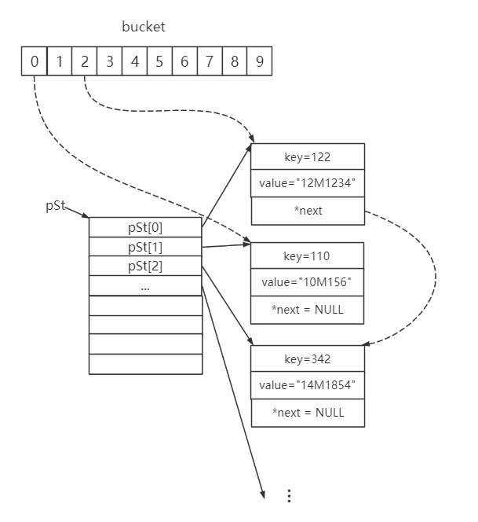

## 题目介绍
### 大数据排序问题
对巨大文件中的数据量进行排序，文件名`source_data.dat`,文件内容类似`<key value>`

```
如： 
234 78M71639
14 6M88173
1847 736M02472
738 6284M17

排序后:
14 6M88173
234 78M71639
738 6284M17
1847 736M02472
    
```

## 题目分析
由于待排序文件过大，因此不能将其全部读入内存，故需要借助外部排序算法。

此处外部排序使用**归并排序算法**, 每个归并段内部排序使用**基数排序**

1. 使用一个读线程将文件内容逐步读入缓冲区`pipe`(文件中缓冲区使用线程安全的顺序循环队列实现，大小为1M)。

2. 使用一个写线程从缓冲区`pipe`中逐行取得数据，形成归并段，生成临时文件。

3. 对每个归并段内部使用**基数排序**，将有序的归并段写入临时文件（如：`./tmp/tmp_r1_0.dat`）。

4. 归并采用最大100路归并，每100路先归并一次，然后再逐步归并。

5. 归并段之间为加快归并效率，使用**败者树**，寻找最小值

6. 归并排序，写入结果文件`source_data_out.dat`

7. `./tmp`内是中间临时文件的形成，方便老师查看(若没有`./tmp`文件夹，请先通过`mkdir tmp`生成该文件夹)。通过`make clean`可清除。

## 待改进的问题

1. 读写文件速度不匹配，读文件每次读取1024字节到缓冲区，写文件从缓冲区取一行(遇到`\n`)写入归并段。【尝试过使用过多个线程读取缓冲区，但是在虚拟机运行时速度不增反降，原因还在找寻。】

2. 可能会存在一些资源回收问题，正在逐步调试。

3. 对生成的临时文件为方便调试和老师查看没有通过代码自动删除，之后有待补充该函数。


## 实现原理图
### 基数排序数据结构图示

<table><tr><td>
<center>

<font size="3">
图 1 基数排序数据结构。此处展示的是基数排序第一轮，从key的个位数字看起，bucket[i]会将个位数字为i的条目项用指针连起来。</font>
</center>
</td></tr>
</table>


### 败者树图示

<table><tr><td>
<center>

<font size="3">
图 2 败者树，用来加快归并段中最小节点的查找。败者树是对树形选择排序的一种变化，它是一颗完全二叉树。每个叶子节点(如：B[0])存放各个归并段在当前位置需要参加归并的记录，其内部节点(如:ltree[1])用来记录左右子数中的“失败者”，从而让胜利者继续比较，一直到根节点。将左右子数中key大的节点定义为失败者，小的为胜利者，则根节点指向的数为最小。</font>
</center>
</td></tr>
</table>


## 运行环境

Linux环境使用`make`即可编译。

`./sort`即可执行，临时文件均生成在`./tmp`文件夹中。

使用`make clean`清除所有生成文件。

### 运行结果图

<table>
<tr><td colspan="2"></td></tr>
<tr>
	<td></td>
    <td></td>
</tr>
<tr>
	<td colspan="2"><center><font size="3">图 3 运行结果</font></center></td>
</tr>
</table>


